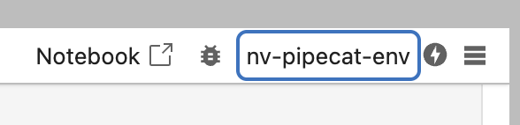

# Environment Setup Guide
Welcome! This guide will help you set up your environment to run the Digital Human Teaching Kit notebooks.

**Prerequisites:**
- You need to be running **macOS**, **Linux**, or **Windows Subsystem for Linux (WSL)**.
- **Python 3.12** is required. [Download Python 3.12 here.](https://www.python.org/downloads/)
- **uv** tool is required. Install it with:
    ```bash
    pip install uv
    ```


## Quickstart

1. **Clone the repository:**
   ```bash
   git clone https://github.com/allysonvasquez/nvidia-pipecat-notebooks.git  

   cd nvidia-pipecat-notebooks
   ```
2. **Create and activate a virtual environment (Python 3.12 required):**
   ```bash
   uv venv --python python3.12 .venv
   source .venv/bin/activate
   ```
3. **Install dependencies:**
   ```bash
   uv pip install -e .
   ```
4. **Register the Jupyter kernel:**
   ```bash
   uv run ipython kernel install --user --name=nv-pipecat-env
   ```
5. **Start JupyterLab:**
   ```bash
   uv run jupyter lab
   ```

### Ensure the Jupyter Kernel is Selected
After setting up, make sure to select the `nv-pipecat-env` kernel in JupyterLab before running any notebooks. This ensures all dependencies and environment variables are available.




## Tips

- If you've aleady set up a virtual environment and kernel, simply run the following to start a session.
```
source .venv/bin/activate
uv run jupyter lab
```
- Store your `NVIDIA_API_KEY` in a `.env` file at the project root:
  ```
  NVIDIA_API_KEY="your_key_here"
  ```
- When opening a notebook, select the `nv-pipecat-env` kernel from the kernel selector in JupyterLab.

## Troubleshooting

### Python Version Issues
- **Error:** `Failed to build nvidia-pipecat-notebooks`
- **Solution:** Ensure you are using Python 3.12.x exactly. Other versions are not supported.

### Kernel Not Found
- **Error:** `Kernel 'nv-pipecat-env' not found`
- **Solution:** Re-run the kernel installation:
  ```bash
  uv run ipython kernel install --user --name=nv-pipecat-env
  ```

### Permission Errors
- **Error:** `error: failed to copy file... Permission denied`
- **Solution:** Do not use sudo. Instead, ensure your user owns the directory:
  ```bash
  chown -R $USER:$USER .
  ```

### Environment Reset
- **To start fresh:**
  ```bash
  # Remove existing environment
  rm -rf .venv  # (Unix/macOS)

  # Create new environment
  uv venv .venv
  # Activate and install as shown above
  ```
- **Update pip and uv:**
  ```bash
  pip install --upgrade pip
  pip install --upgrade uv
  ```

## Verifying Your Setup
- Open the `1-AI-Fundamentals` notebook.
- Run the first cell to ensure the environment is working and you can call a NIM (NVIDIA Inference Microservice).

If you encounter issues, please refer to this guide or ask for help! 